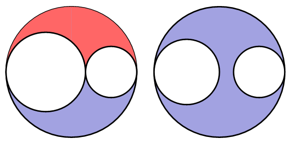

# 원 영역

문제 번호: 10000
알고리즘 분류: 스위핑, 스택
푼 날짜: 2021년 5월 1일 오후 1:45

## 문제링크

[https://www.acmicpc.net/problem/10000](https://www.acmicpc.net/problem/10000)

## 조건

- 시간 제한 : 1s
- 메모리 제한 : 256MB

---

## 문제

x축 위에 원이 N개 있다. 원은 서로 교차하지 않는다. 하지만, 접할 수는 있다.

원으로 만들어지는 영역이 몇 개인지 구하는 프로그램을 작성하시오.

영역은 점의 집합으로 모든 두 점은 원을 교차하지 않는 연속되는 곡선으로 연결될 수 있어야 한다.


## 입력

첫째 줄에 원의 개수 N(1 ≤ N ≤ 300,000)이 주어진다.

다음 N개 줄에는 각 원의 정보 xi와 ri가 주어진다. xi는 원의 중심 좌표이며, ri는 반지름이다. (-109 ≤ xi ≤ 109, 1 ≤ ri ≤ 109)

입력으로 주어지는 원은 항상 유일하다.

## 출력

첫째 줄에 원으로 인해서 만들어지는 영역의 개수를 출력한다.

## 해설

원에 의해 나눠지는 영역의 수를 헤아리는 문제이다. 원이 겹쳐지지 않고 접할수만 있어서 비교적 쉽게 해결이 가능하다. 원의 영역이 위-아래 2개로 나눠지는 경우는 원의 지름이 모두 접하는 작은 원들로 채워져있을때 이다. 



위 경우를 지름에 대해서만 나타내면 아래처럼 나타낼 수 있는데, 긴 지름에 대해서 짧은 지름들이 합쳐져서 완전한 긴 지름을 만들 수 있으면 구역이 분리된다.


이를 구현하기 위해 입력된 원의 지름을 x좌표를 기준으로 왼쪽끝에 대해서 오름차순, 오른쪽 끝에 대해 내림차순으로 정렬하였다. 다른 예시를 그림으로 나타내면 아래와 같다.


긴 반지름을 짧은 반지름을 통해 완전히 표현가능한 경우에는 원 하나당 구역을 2개 만들 수 있고 그렇지 않은 경우에는 원 하나당 구역을 1개 만들 수 있다. 나눠진 구역 개수를 합쳐 원하는 결과를 출력하면 된다.

## 풀이

구역에 대해 계산할 때 원이 겹쳐질 수 없고 접하는 것만 가능하므로 어떤 선에 대해서 해당 선의 시작~끝점 안에 있는 선들만이 어떤 선이 의미하는 원의 구역을 2개로 나눠지는지를 결정할 수 있다. 위 처럼 왼쪽 점을 기준으로 오름차순, 오른쪽 점을 기준으로 내림차순으로 정렬된 경우에 어떤 선 `line[i]`에 대해서 그 선 안에 있는 작은 선들이 `line[i+@]`으로 주어지므로, 이 선들이 `line[i]`를 만들 수 있는지 검사하면 된다.

아래 그림에서 파란 선이 주어지고, 빨간 선이 주어지고, 검은색 선이 주어지게 된다. 빨간 선이 의미하는 원의 구역을 나눌 수 있는지를 결정할 때는 파란색 선이 사용되지 않고, 검은색 선이 사용된다. 즉, 가장 마지막에 주어진 선들에 대해서만 연산이 진행되므로, `stack` 구조를 이용해 stack의 `top`에 있는 값만 비교하면서 구역이 잘 만들어지고 있는지 검사하는 방법을 사용했다.


선을 나타내기 위한 자료구조로 `circle` 구조체를 사용했다. `from`은 왼쪽 점, `to`는 오른쪽 점, `pointer`는 현재 선이 얼마나 채워졌는지를 나타낸다. `pointer` 값이 `to` 값과 같다면 해당 원은 영역이 2개로 나뉘는 원이다.

```cpp
struct circle {
    long long from, to, pointer;

    circle(int A, int B) {
        from = A;
        to = B;
        pointer = A;
    }
};
```

아래 코드처럼 `circle` 에 해당하는 값들로 바꾸어 `map` 벡터에 저장해두고, 정렬을 진행했다. 뒤죽박죽으로 주어진 원들이 원하는 형태로 가공되었다.

```cpp
bool cmp(circle A, circle B) {
    if(A.from == B.from) {
        return A.to > B.to;
    }
    return A.from < B.from;
}

int main() {
    FAST;

    int N;
    cin >> N;

    vector<circle> map;
    for(int i = 0; i < N; i++) {
        int pos, rad;
        cin >> pos >> rad;
        map.push_back(circle(pos-rad, pos+rad));
    }

    sort(map.begin(), map.end(), cmp);

		...
}
```

아무것도 없을 때 빈 영역 1개와 원 하나당 고유한 영역 1개씩 생성되므로, result의 초깃값은 `N+1`로 한다.

x축을 기준으로 작은 값 → 큰 값으로 이동하며 차례로 값을 계산하고 있는데, 만약 선분이 현재 연산중인 x보다 뒤에 있다면(지나쳤다면) 다시 연산에 사용되지 않는 필요없는 값이므로 stack에서 `pop`해주면 된다. 이를 위해 `map` 벡터에 저장된 i번째 `circle`에 대해 현재 stack에서 map[i]의 from 보다 to 값이 작은 circle들을 스택에서 `pop`시켜준다. 이때 해당 원이 구역이 분리된 원이라면 (`pointer` 값이 `to` 값과 같다면) `result++`을 수행해준다.

stack에 남아있는 선에 대해 top에 있는 선의 pointer와 `map[i]`의 from을 비교한다. 만약에 `pointer==from` 이라면 `pointer`값을 `map[i]`의 to 값으로 바꿔준다. 아래 그림에서는 파란 선에 대해 pointer 값이 검은색 선의 from과 같으므로 연결이 가능하여 pointer 값이 검은 선의 to로 대입되었다. 이후 검은 선의 구역을 반으로 나눌 수 있는지를 검사하기 위해 검은 선이 stack에 push 되겠지만, 나중에 파란 선이 x값을 보다 작아지게 되면서 (지나치면서) pop될 때 해당 영역이 2개로 나뉘는 것을 확인하고 `result++`을 수행하게 된다.


위 과정을 코드로 옮기면 아래와 같다.

```cpp
stack<circle> st;
int result = N+1;

for(int i = 0; i < N; i++) {
    if(!st.empty()) {
        while(!st.empty() && st.top().to <= map[i].from) {
            if(st.top().pointer == st.top().to) result++;
            st.pop();
        }
        if(!st.empty()) {
            if(st.top().pointer == map[i].from) {
                st.top().pointer = map[i].to;
            }
        } 
    } 
    st.push(map[i]);
}

while(!st.empty()) {
    if(st.top().pointer == st.top().to) result++;
    st.pop();
}

cout << result;
```

마지막에 아직 stack에 남아있는 원들에 대해 2개 영역으로 나뉘는지를 검사한 뒤 `result`를 출력하면 원하는 결과를 얻을 수 있다.

---

## 코멘트

stack 구조를 사용하면 쉽게 풀 수 있다는걸 알아채는데 30분 정도 쓴 것 같다. 처음에는 queue 인가? 하고 있었는데,, 그래도 풀이 안보고 잘 풀었다고 생각해.

---

## 코드

```cpp
#include <iostream>
#include <vector>
#include <stack>
#include <algorithm>
#define FAST ios::sync_with_stdio(false), cin.tie(0), cout.tie(0);

using namespace std;

struct circle {
    long long from, to, pointer;

    circle(int A, int B) {
        from = A;
        to = B;
        pointer = A;
    }
};

bool cmp(circle A, circle B) {
    if(A.from == B.from) {
        return A.to > B.to;
    }
    return A.from < B.from;
}

int main() {
    FAST;

    int N;
    cin >> N;
    int result = N+1;

    vector<circle> map;
    for(int i = 0; i < N; i++) {
        int pos, rad;
        cin >> pos >> rad;
        map.push_back(circle(pos-rad, pos+rad));
    }

    sort(map.begin(), map.end(), cmp);
    
    stack<circle> st;
    for(int i = 0; i < N; i++) {
        if(!st.empty()) {
            while(!st.empty() && st.top().to <= map[i].from) {
                if(st.top().pointer == st.top().to) result++;
                st.pop();
            }
            if(!st.empty()) {
                if(st.top().pointer == map[i].from) {
                    st.top().pointer = map[i].to;
                }
            } 
        } 
        st.push(map[i]);
    }
    while(!st.empty()) {
        if(st.top().pointer == st.top().to) result++;
        st.pop();
    }

    cout << result;

    return 0;
}
```