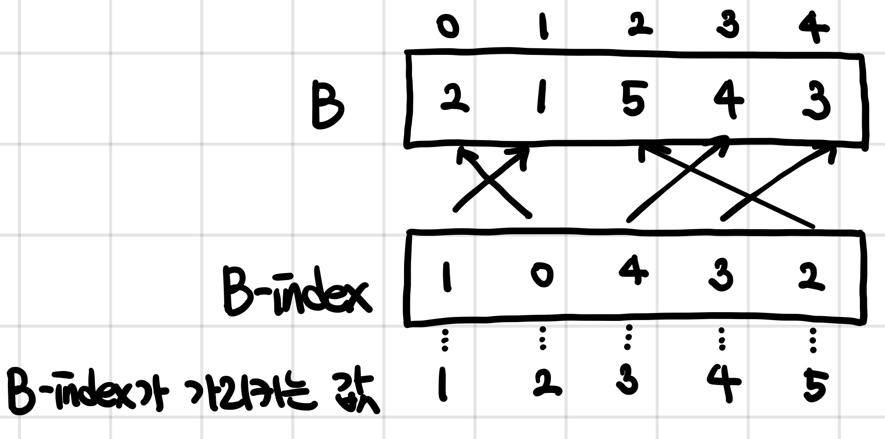

# 보물

문제 번호: 1026
알고리즘 분류: 정렬
푼 날짜: 2021년 1월 23일 오후 6:28

### 문제 링크

[https://www.acmicpc.net/problem/1026](https://www.acmicpc.net/problem/1026)

## 문제

옛날 옛적에 수학이 항상 큰 골칫거리였던 나라가 있었다. 이 나라의 국왕 김지민은 다음과 같은 문제를 내고 큰 상금을 걸었다.

길이가 N인 정수 배열 A와 B가 있다. 다음과 같이 함수 S를 정의하자.

S = A[0]×B[0] + ... + A[N-1]×B[N-1]

S의 값을 가장 작게 만들기 위해 A의 수를 재배열하자. **단, B에 있는 수는 재배열하면 안 된다.**

S의 최솟값을 출력하는 프로그램을 작성하시오.

## 입력

첫째 줄에 N이 주어진다. 둘째 줄에는 A에 있는 N개의 수가 순서대로 주어지고, 셋째 줄에는 B에 있는 수가 순서대로 주어진다. N은 50보다 작거나 같은 자연수이고, A와 B의 각 원소는 100보다 작거나 같은 음이 아닌 정수이다.

## 출력

첫째 줄에 S의 최솟값을 출력한다.

## 조건

- 시간 제한 : 2s
- 메모리 제한 : 128MB

---

## 해설

B 배열에 있는 원소를 재배열하면 안된다는 조건이 붙어있다. B의 원소 대신 **B의 index를 정렬하여 B의 원소를 크기 순으로 간접적으로 정렬**하는 방법을 선택하였다. 병합 정렬 알고리즘의 일부를 수정하여 index를 정렬하는 알고리즘을 만들고, b index 배열에 따라 A를 재배열하였다. A를 재배열할 때는, A 배열의 가장 작은 원소가 B 배열의 가장 큰 원소부터 차례로 곱해지도록 배열한다. 그 다음, 곱의 합을 구해 출력하면 된다.

## 풀이

B 배열에 있는 원소를 재배열하면 안된다는 조건이 붙어있는 문제이다. 곱의 합이 최소가 되기 위해서는 A가 가장 큰 수부터 B의 가장 작은 수와 차례로 곱해져야 한다. 이를 위해 A는 내림차순으로, B는 오름차순으로 정렬하여 곱의 합을 구해야 하지만, B를 정렬할 수 없다는 조건이 붙어있으므로 다른 방법을 찾아야 했다. 그래서, B의 index를 정렬하는 방법을 생각해보았다. 



B의 값을 통해 B의 index를 담고있는 배열을 정렬하기 위해, 정렬 알고리즘을 약간 수정해주었다. 인자로 arr과 indexArr을 모두 받아온다. 값 비교는 `*(arr+indexArr[i])` 과 같이 arr의 값에 접근해서 하며, 그에 따른 정렬은 `indexArr`의 원소끼리 정렬하도록 하여 indexArr을 정렬한다.

```cpp
void merge(int* arr, int* indexArr, int left, int mid, int right) {
// 중간 생략 - 모든 코드는 아래에
    while(i <= j && k <= l) {
        if(*(arr+indexArr[i]) < *(arr+indexArr[k])) {
            sorted[index++] = indexArr[i++];
        } else {
            sorted[index++] = indexArr[k++];
        }
    }
// 중간 생략 - 모든 코드는 아래에
    for(int m = left; m <= right; m++) {
        indexArr[m] = sorted[m-left];
    }
    
    delete[] sorted;
    return;
}
```

정렬 알고리즘을 통해 bArray의 index를 bArray의 값을 기준으로 오름차순으로 정렬했고, aArray의 원소는 `sort()` 함수를 통해 정렬하여 aSortedArray에 저장한다. 그 다음, **bIndexArray를 기준으로 aArray를 재배열**한다. 곱의 합이 가장 작아지기 위해서 A 배열의 가장 작은 원소가 B 배열의 가장 큰 원소부터 순서대로 곱해지도록 재배열하여야 한다.

이후, aArray와 bArray 원소간의 곱의 합을 구하여 출력한다.

---

## 코멘트


---

## 코드

```cpp
#include <iostream>
#include <algorithm>
using namespace std;
void indexMergeSort(int* arr, int* indexArr, int left, int right);
void merge(int* arr, int* indexArr, int left, int mid, int right);

void indexMergeSort(int* arr, int* indexArr, int left, int right) {
    if(left < right) {
        int mid = (left+right)/2+1;
        
        indexMergeSort(arr, indexArr, left, mid-1);
        indexMergeSort(arr, indexArr, mid, right);
        
        merge(arr, indexArr, left, mid, right);
    }
}

void merge(int* arr, int* indexArr, int left, int mid, int right) {
    int i = left, j = mid-1, k = mid, l = right;
    int* sorted = new int[l-i+1];
    int index = 0;
    
    while(i <= j && k <= l) {
        if(*(arr+indexArr[i]) < *(arr+indexArr[k])) {
            sorted[index++] = indexArr[i++];
        } else {
            sorted[index++] = indexArr[k++];
        }
    }
    
    if (i > j) {
        for(; k <= l;) {
            sorted[index++] = indexArr[k++];
        }
    } else {
        for(; i <= j;) {
            sorted[index++] = indexArr[i++];
        }
    }
    
    for(int m = left; m <= right; m++) {
        indexArr[m] = sorted[m-left];
    }
    
    delete[] sorted;
    return;
}

int main() {
    int number, sum = 0;
    int* aArray; 
    int* bArray; 
    int* aSortedArray;
    int* bIndexArray;
// 입력
    cin >> number;
    aArray = new int[number];
    bArray = new int[number];
    aSortedArray = new int[number];
    bIndexArray = new int[number];
    
    for(int i = 0; i < number; i++) {
        scanf("%d", &aArray[i]);
        aSortedArray[i] = aArray[i];
    }
    
    for(int i = 0; i < number; i++) {
        scanf("%d", &bArray[i]);  
        bIndexArray[i] = i;
    }
    
// 정렬
    sort(aSortedArray, aSortedArray+number);
    indexMergeSort(bArray, bIndexArray, 0, number-1);
    
// 출력
    for(int i = 0; i < number; i++) {
        aArray[bIndexArray[i]] = aSortedArray[number-i-1];
    }
    
    for(int i = 0; i < number; i++) {
        sum += aArray[i] * bArray[i];
    }
    
    printf("%d", sum);
    return 0;
}
```
