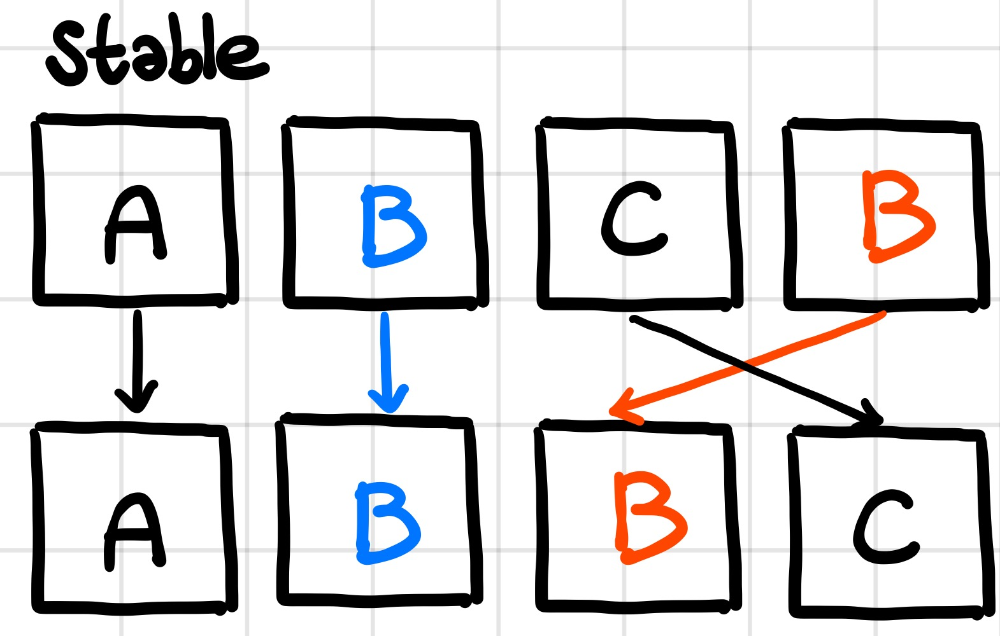
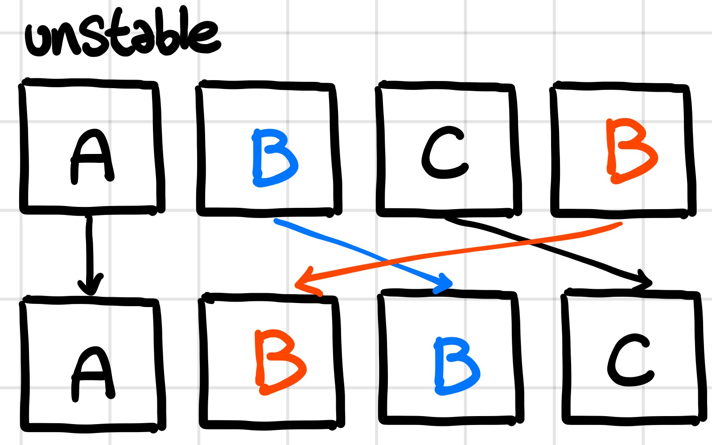

# 나이순 정렬

문제 번호: 10814
알고리즘 분류: 정렬
푼 날짜: 2021년 1월 23일 오후 5:14

### 문제 링크

[https://www.acmicpc.net/problem/10814](https://www.acmicpc.net/problem/10814)

## 문제

온라인 저지에 가입한 사람들의 나이와 이름이 가입한 순서대로 주어진다. 이때, 회원들을 나이가 증가하는 순으로, 나이가 같으면 먼저 가입한 사람이 앞에 오는 순서로 정렬하는 프로그램을 작성하시오.

## 입력

첫째 줄에 온라인 저지 회원의 수 N이 주어진다. (1 ≤ N ≤ 100,000)

둘째 줄부터 N개의 줄에는 각 회원의 나이와 이름이 공백으로 구분되어 주어진다. 나이는 1보다 크거나 같으며, 200보다 작거나 같은 정수이고, 이름은 알파벳 대소문자로 이루어져 있고, 길이가 100보다 작거나 같은 문자열이다. 입력은 가입한 순서로 주어진다.

## 출력

첫째 줄부터 총 N개의 줄에 걸쳐 온라인 저지 회원을 나이 순, 나이가 같으면 가입한 순으로 한 줄에 한 명씩 나이와 이름을 공백으로 구분해 출력한다.

## 조건

- 시간 제한 : 3s
- 메모리 제한 : 256MB

---

## 해설

나이에 따라 정렬을 하며, 나이가 같은 경우에는 들어온 입력 그대로 정렬을 하면 된다. 즉, 정렬 기준에 대한 값이 같다면 원소의 다른 값은 정렬에 영향을 미치지 않으며, 순서가 섞이지 않아야 한다. 이러한 방식의 정렬은 **stable 한 정렬**이라고 부른다. 

C++에서 기본적으로 제공하는 `sort()` 는 quick sort 방식으로, unstable하다. 즉, 정렬 기준의 값이 같은 원소끼리 자리가 바뀔 수 있다. 



우리에게 익숙한 병합 정렬이 stable한 정렬의 예시이다. 정렬 기준의 값이 같다면 원소끼리의 자리가 바뀌지 않고 유지된다.



Stable한 정렬방식이 unstable한 정렬 방식보다 cost가 높기 때문에, 따로 함수를 만들어두었다. 특별히 stable 정렬을 반드시 사용해야 하는 상황에는 `sort()`가 아닌, `stable_sort()`를 사용해주면 된다. 

## 풀이

age, name을 갖는 구조체를 member 라는 이름으로 선언해주었다. member를 입력받아올 만큼 동적으로 member 배열을 할당해주고, 입력 받을 때 member에 나이와 이름을 넣어주었다. 문자열도 문자 배열로 관리해주기에 동적할당 해주었다. 

`sort()` 는 **unstable 한 정렬 방식**이므로, 문제의 조건에 따라 입력 받은 순서를 유지하기 위해서는 **stable한 정렬 방식**인 `stable_sort()`를 사용해주었다. 

```cpp
// sort(memberList, memberList+number, compare);
stable_sort(memberList, memberList+number, compare);
```

compare 함수에서는 나이만을 비교한다.

```cpp
bool compare(member a, member b) {
    return a.age < b.age;
}
```

---

## 코멘트

왜 틀렸는지 전혀 모르겠어서 고민하다가 검색을 해봤는데, stable sort와 unstable sort에 대한 정보를 얻을 수 있었다. 신비로운 알고리즘의 세계... quick sort가 unstable sort이고, merge sort가 stable sort이며, stable sort에서 더 많은 코스트가 발생한다. 기억해두고, 필요할 때 이러한 점을 떠올리자!

---

## 코드

```cpp
#include <iostream>
#include <algorithm>
using namespace std;

struct member {
    int age;
    char* name;
};

bool compare(member a, member b) {
    return a.age < b.age;
}

int main() {
    int number, age, nameIndex;
    char name[101];
    char* tempName;
    cin >> number;
    
    member* memberList = new member[number];
    
    for(int i = 0; i < number; i++) {
        nameIndex = 0;
        
        scanf("%d %s", &age, name);
        memberList[i].age = age;
        
        tempName = new char[(int)sizeof(name)/(int)sizeof(char)];
        while(name[nameIndex] != 0) {
            tempName[nameIndex] = name[nameIndex];
            nameIndex++;
        }
        
        tempName[nameIndex]=0;
        memberList[i].name = tempName;
}
    
    // sort(memberList, memberList+number, compare);
    stable_sort(memberList, memberList+number, compare);
    
    for(int i = 0; i < number; i++) {
        printf("%d %s\n", memberList[i].age, memberList[i].name);
    }
    
    return 0;
}
```