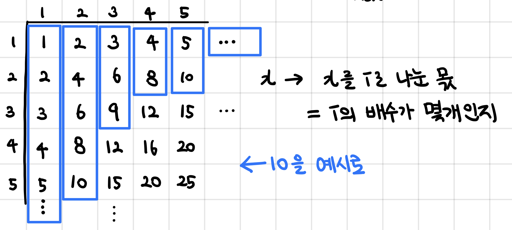

# K번째 수

문제 번호: 1300
알고리즘 분류: 이분 탐색
푼 날짜: 2021년 1월 31일 오후 5:34

### 문제 링크

[https://jaimemin.tistory.com/988](https://jaimemin.tistory.com/988)

## 문제

세준이는 크기가 N×N인 배열 A를 만들었다. 배열에 들어있는 수 A[i][j] = i×j 이다. 이 수를 일차원 배열 B에 넣으면 B의 크기는 N×N이 된다. B를 오름차순 정렬했을 때, B[k]를 구해보자.

배열 A와 B의 인덱스는 1부터 시작한다.

## 입력

첫째 줄에 배열의 크기 N이 주어진다. N은 10^5보다 작거나 같은 자연수이다. 둘째 줄에 k가 주어진다. k는 min(10^9, N^2)보다 작거나 같은 자연수이다.

## 출력

B[k]를 출력한다.

## 조건

- 시간 제한 : 2s
- 메모리 제한 : 128MB

---

## 해설

무엇을 binary search의 대상으로 둘 수 있는지에 대해 고민해야하는 문제이다. 이 경우에 숫자 x에 대해 x 보다 작은 원소 개수가 x가 커질때 항상 단조증가하므로, **x 아래의 원소 개수와 k (특정 수 아래의 원소 개수) 를 비교하여 binary search로 특정한 수를 찾는다.**

## 풀이

찾고자 하는 값은 A 배열의 원소를 정렬했을 때 k번째 수이다. 실질적으로 NxN 배열의 원소들을 배열에 담고 정렬하기에는 시,공간적인 제한이 있어서 불가능하다. 따라서 다른 방법을 사용해야한다.

이 문제를 해결하기 위해 k에 대한 binary search 알고리즘을 이용해 k를 탐색하여, 구하고자 하는 값을 찾았다. 

탐색을 위해 아래와 같은 방식으로 특정 값 x에 대한 index를 찾는 방식이다. 아래에서 x를 1로 나누었을 때, 2로 나누었을 때 x까지 갖게되는 원소의 개수를 찾을 수 있다. 



이를 코드로 구현하면 아래와 같다. 행, 열의 크기 제한이 N까지이므로 N열까지 i를 증가시키고, count에 더해지는 값은 최대 N으로 제한한다. 이를 이용하면 A 배열을 정렬했을 때 x의 index를 구할 수 있다.

```cpp
for(int i = 1; i <= N; i++) {
    count += min(x/i, N);
}
```

이 index를 이용해 k에 해당하는 x값을 탐색하면 된다. 범위를 이동시키는 조건문을 k와 위에서 구한 count를 이용한다. 

```cpp
int left = 1, right = K;
while(left <= right) {
    int count = 0;
    int mid = (left + right) /2;
    for(int i = 1; i <= N; i++) {
        count += min(mid/i, N);
    }
    
    if(count >= K) {
        right = mid-1;
        result = mid;
    } else {
        left = mid + 1;
    }
}
```

---

## 코멘트

이분 탐색으로 가기 전 조건

1. 함수로 만들어보기
2. 항상 증가/감소하는 함수값인가?
3. 쪼개어 풀기

---

## 코드

```cpp
#include <iostream>
#include <algorithm>
using namespace std;

int main() {
    int N, K;
    
    cin >> N;
    cin >> K;
    
    int left = 1, right = K;
    int result;
    while(left <= right) {
        int count = 0;
        int mid = (left + right) /2;
        for(int i = 1; i <= N; i++) {
            count += min(mid/i, N);
        }
        
        if(count >= K) {
            right = mid-1;
            result = mid;
        } else {
            left = mid + 1;
        }
    }
    
    cout << result;
    
    return 0;
}
```