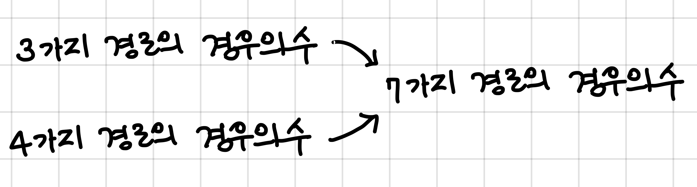

# 내리막 길

문제 번호: 1520
알고리즘 분류: DP, 그래프
푼 날짜: 2021년 7월 10일 오후 1:41

## 문제링크

[https://www.acmicpc.net/problem/1520](https://www.acmicpc.net/problem/1520)

## 문제

여행을 떠난 세준이는 지도를 하나 구하였다. 이 지도는 아래 그림과 같이 직사각형 모양이며 여러 칸으로 나뉘어져 있다. 한 칸은 한 지점을 나타내는데 각 칸에는 그 지점의 높이가 쓰여 있으며, 각 지점 사이의 이동은 지도에서 상하좌우 이웃한 곳끼리만 가능하다.

[https://upload.acmicpc.net/0e11f3db-35d2-4b01-9aa0-9a39252f05be/-/preview/](https://upload.acmicpc.net/0e11f3db-35d2-4b01-9aa0-9a39252f05be/-/preview/)

현재 제일 왼쪽 위 칸이 나타내는 지점에 있는 세준이는 제일 오른쪽 아래 칸이 나타내는 지점으로 가려고 한다. 그런데 가능한 힘을 적게 들이고 싶어 항상 높이가 더 낮은 지점으로만 이동하여 목표 지점까지 가고자 한다. 위와 같은 지도에서는 다음과 같은 세 가지 경로가 가능하다.

[https://upload.acmicpc.net/917d0418-35db-4081-9f62-69a2cc78721e/-/preview/](https://upload.acmicpc.net/917d0418-35db-4081-9f62-69a2cc78721e/-/preview/)

[https://upload.acmicpc.net/1ed5b78d-a4a1-49c0-8c23-12a12e2937e1/-/preview/](https://upload.acmicpc.net/1ed5b78d-a4a1-49c0-8c23-12a12e2937e1/-/preview/)

[https://upload.acmicpc.net/e57e7ef0-cc56-4340-ba5f-b22af1789f63/-/preview/](https://upload.acmicpc.net/e57e7ef0-cc56-4340-ba5f-b22af1789f63/-/preview/)

지도가 주어질 때 이와 같이 제일 왼쪽 위 지점에서 출발하여 제일 오른쪽 아래 지점까지 항상 내리막길로만 이동하는 경로의 개수를 구하는 프로그램을 작성하시오.

## 입력

첫째 줄에는 지도의 세로의 크기 M과 가로의 크기 N이 빈칸을 사이에 두고 주어진다. 이어 다음 M개 줄에 걸쳐 한 줄에 N개씩 위에서부터 차례로 각 지점의 높이가 빈 칸을 사이에 두고 주어진다. M과 N은 각각 500이하의 자연수이고, 각 지점의 높이는 10000이하의 자연수이다.

## 출력

첫째 줄에 이동 가능한 경로의 수 H를 출력한다. 모든 입력에 대하여 H는 10억 이하의 음이 아닌 정수이다.

## 조건

- 시간 제한 : 2s
- 메모리 제한 : 128MB

---

## 해설

첫번째 칸에서 마지막 칸까지 이동하는 경로의 경우의 수를 구하는 문제이다. 단순하게 그래프 탐색을 통해 모든 경로를 탐색해 구하기에는 시간이 오래걸리므로, 다른 방법이 필요하다.

처음 문제를 보고 각 칸에 대해 indegree를 count하여 문제를 푸는 해결방법을 생각하고 접근했었는데, 다른 블로그에서 사용하지 않는 방법이라 혼자 문제를 풀어야 했다. 메모리는 더 쓰지만 (벡터를 하나 더 사용) 속도는 더 빠르다.

경로는 항상 높은 칸에서 낮은 칸으로 이동한다는 점과, 어떤 칸에 갈 수 있는 경로의 경우의 수는 결정되고 나서는 바뀌지 않는다는 점을 이용하여 아래와 같이 설계하였다.

1. 3개의 벡터를 만들어주고 countMap을 set한다. 
    - map : 입력값을 저장
    - countMap : 주변에 자기 칸보다 높은 칸의 개수를 저장, 경로를 모두 구한 경우에 -1으로 set
    - pathMap : 자신의 칸까지 도달하는 경로의 경우의 수를 저장

countMap은 map에서 자신의 칸과 주변 칸을 비교하여 더 높은 값의 개수를 저장해준다. 그 중에서 countMap의 값이 0인 칸은 (해당 칸으로 들어갈 수 없고, 나가기밖에 못하는 칸) 순서대로 처리를 위해 **큐에 담아준다.**

2. 큐에 들어있는 칸을 차례대로 처리해준다.

큐의 front에서 칸에 대한 정보 (row, column 좌표) 를 가져와서 경로가 확정되었다는 의미로 `countMap` 값을 -1로 만들어주고, 해당 칸 주변에 있는 **더 낮은 칸**에 해당 칸의 pathMap 값을 더해준다. (`pathMap[newx][newy] += pathMap[x][y]`) 아래 그림처럼, 주변에 자기보다 높은 칸까지 오는 경우의 수의 합이 자신의 경로의 경우의 수와 같으므로 주변에서 값을 가져와 더해주어 기록하는 것이다. 그 다음, 선행하여 처리해야 할 칸이 하나 줄었다는 의미로 낮은 칸의 좌표에 해당하는 `countMap` 값을 -1 해준다. 만약 이 값이 -1을 수행하여 0이 되었다면 큐에 낮은 칸의 좌표를 담아준다.



위 과정을 큐에 들어있는 원소를 하나씩 pop하면서 반복하여 처리해준다.

3. 큐에 더이상 새로운 값이 들어오지 않을 때 까지 (모든 좌표에 대해 경로를 계산한 경우) 반복을 종료하고 마지막 칸의 `pathMap` 값을 출력해주고 프로그램을 종료한다.


## 풀이

먼저 입력 값들을 받아오고 map, countMap, pathMap을 선언해준다.

```cpp
int M, N;
cin >> M >> N;

// map : 높이 값 저장
// countMap : 각 cell 주변에 처리해야 할 더 높은 cell의 개수 저장
// pathMap : 각 cell 에 도달할 수 있는 경로의 경우의 수
vector<vector<int>> map(M, vector<int>(N));
vector<vector<int>> countMap(M, vector<int>(N));
vector<vector<int>> pathMap(M, vector<int>(N));

for(int row = 0; row < M; row++) {
    for(int column = 0; column < N; column++) {
        cin >> map[row][column];
    }
}
```

각 칸에 대해서 countMap을 set 해주어야 한다. `map[row][column]`에 대해 그 주변의 4개의 칸을 비교하여 더 높은 값의 개수를 `countMap[row][column]`에 저장한다. 만약 이 값이 0이라면 바로 queue에 row, column 값을 push해준다. (먼저 처리해야할 칸이 없으므로 바로 경로 값 고정 가능)

```cpp
int dx[] = {1, 0, -1, 0};
int dy[] = {0, 1, 0, -1};

for(int row = 0; row < M; row++) {
    for(int column = 0; column < N; column++) {
        int count = 0;

        for(int i = 0; i < 4; i++) {
            int x = column + dx[i];
            int y = row + dy[i];
            
            if(0 <= x && x < N && 0 <= y && y < M) {
                if(map[y][x] > map[row][column]) count++;
            }
        }
        
        countMap[row][column] = count;
        
        if(count == 0) Q.push(make_pair(row, column));
    }
}
```

초깃값으로 pathMap[0][0]에 1을 주고, 큐가 빌 때 까지 다음 반복을 수행한다. 큐에서 값을 가져와, 해당 좌표의 countMap 값을 -1로 만들어주고, 해당 좌표의 `map` 값보다 주변의 map 값이 낮다면 (이동이 가능하다면) 해당 좌표의 `pathMap` 값을 낮은 좌표의 `pathMap` 에 더해주고, 낮은 좌표의 `countMap` 값을 1 낮춘다. (선행해야 할 좌표를 하나 처리했다는 의미) 이때 countMa의 값이 0이 되었다면 큐에 넣어준다.  

```cpp
int dx[] = {1, 0, -1, 0};
int dy[] = {0, 1, 0, -1};

queue<pair<int, int>> Q;
pathMap[0][0] = 1;
while(!Q.empty()) {
    int row = Q.front().first;
    int column = Q.front().second;
    Q.pop();

    countMap[row][column]--;

    for(int i = 0; i < 4; i++) {
        int x = column + dx[i];
        int y = row + dy[i];
        
        if(0 <= x && x < N && 0 <= y && y < M) {
            if(map[y][x] < map[row][column]) {
                pathMap[y][x] += pathMap[row][column];
                countMap[y][x]--;
                
                if(countMap[y][x] == 0) Q.push(make_pair(y, x));
            }
        }
    }
}
```

큐가 빌 때 까지 위 반복을 수행하고나서 아래 코드를 수행하면 원하는 결과를 얻을 수 있다.

```cpp
cout << pathMap[M-1][N-1] << '\n';
```

---

## 코멘트

남들이 안풀어본 방법으로 푸는 일은 정말 신나는 일이야!

---

## 코드

```cpp
include <iostream>
#include <vector>
#include <queue>
using namespace std;

int main(int argc, const char * argv[]) {
    ios::sync_with_stdio(0);
    cin.tie(0);

    int M, N;
    cin >> M >> N;

    // map : 높이 값 저장
    // countMap : 각 cell 주변에 처리해야 할 더 높은 cell의 개수 저장
    // pathMap : 각 cell 에 도달할 수 있는 경로의 경우의 수
    vector<vector<int>> map(M, vector<int>(N));
    vector<vector<int>> countMap(M, vector<int>(N));
    vector<vector<int>> pathMap(M, vector<int>(N));
    
    for(int row = 0; row < M; row++) {
        for(int column = 0; column < N; column++) {
            cin >> map[row][column];
        }
    }

    int dx[] = { 1, 0, -1, 0};
    int dy[] = {0, 1, 0, -1};
    
    for(int row = 0; row < M; row++) {
        for(int column = 0; column < N; column++) {
            int count = 0;

            for(int i = 0; i < 4; i++) {
                int x = column + dx[i];
                int y = row + dy[i];
                
                if(0 <= x && x < N && 0 <= y && y < M) {
                    if(map[y][x] > map[row][column]) count++;
                }
            }
            
            countMap[row][column] = count;
            
            if(count == 0) Q.push(make_pair(row, column));
        }
    }

    queue<pair<int, int>> Q;
    pathMap[0][0] = 1;
    while(!Q.empty()) {
        int row = Q.front().first;
        int column = Q.front().second;
        Q.pop();

        countMap[row][column]--;

        for(int i = 0; i < 4; i++) {
            int x = column + dx[i];
            int y = row + dy[i];
            
            if(0 <= x && x < N && 0 <= y && y < M) {
                if(map[y][x] < map[row][column]) {
                    pathMap[y][x] += pathMap[row][column];
                    countMap[y][x]--;
                    
                    if(countMap[y][x] == 0) Q.push(make_pair(y, x));
                }
            }
        }
    }

    cout << pathMap[M-1][N-1] << '\n';
    return 0;
}
```

---

## 문제 해결에 대한 고민

DFS와 DP를 섞어서 문제를 푸는 방법도 있다.

```cpp
#include <iostream>

using namespace std;

int dx[] = { 1, 0, -1, 0};
int dy[] = {0, 1, 0, -1};
int map[501][501];
int dp[501][501];
int M, N;

int DFS(int row, int column) {
    if(row == M && column == N) return 1;

    else if(dp[row][column] == -1) {
        dp[row][column] = 0;
        for(int i = 0; i < 4; i++) {
            int x = dx[i] + column;
            int y = dy[i] + row;

            if(0 < x && x <= N && 0 < y && y <= M) {
                if(map[row][column] > map[y][x]) {
                    dp[row][column] += DFS(y, x);
                }
            }
        }
    }
    return dp[row][column];
}

int main() {

    cin >> M >> N;

    for(int i = 0; i <= M; i++) {
        for(int j = 0; j <= N; j++) {
            dp[i][j] = -1;
            map[i][j] = 10001;
        }
    }

    for(int i = 1; i <= M; i++) {
        for(int j = 1; j <= N; j++) {
            cin >> map[i][j];
        }
    }

    cout << DFS(1, 1);

    return 0;
}
```
