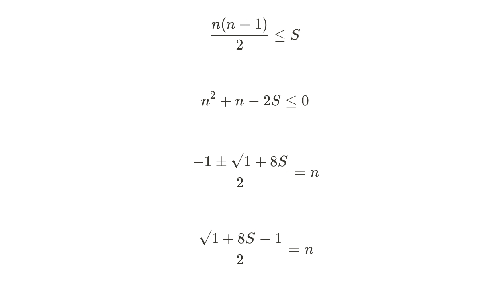

# 수들의 합

문제 번호: 1789
알고리즘 분류: 수학, 이분 탐색
푼 날짜: 2021년 1월 31일 오후 12:06

### 문제 링크

[https://www.acmicpc.net/problem/1789](https://www.acmicpc.net/problem/1789)

## 문제

서로 다른 N개의 자연수의 합이 S라고 한다. S를 알 때, 자연수 N의 최댓값은 얼마일까?

## 입력

첫째 줄에 자연수 S(1 ≤ S ≤ 4,294,967,295)가 주어진다.

## 출력

첫째 줄에 자연수 N의 최댓값을 출력한다.

## 조건

- 시간 제한 : 2S
- 메모리 제한 : 128MB

---

## 해설

서로 다른 자연수의 합으로 S를 만들고자 할 때 자연수의 최대 개수 N을 정하는 기준은 **1~N까지의 합으로 S를 만들 수 있는가** 이다. 

예를 들어, S가 15라면 1+2+3+4+5 5개의 수로 만들 수 있고, S가 20이라면 2+3+4+5+6 5개의 수로 만들 수 있고, 21이라면 1+2+3+4+5+6 6개의 수가 사용된다. 즉, 1~N까지의 합을 기준으로 개수 N이 정해진다. 이 N을 찾기 위해 아래의 2가지 방법이 있다.

1. 덧셈으로 찾기
2. 수학적으로 찾기

## 풀이

### 덧셈으로 찾기 - O(n^0.5)

1, 2, 3을 차례대로 더하면서 count하고, 합이 S보다 커지면 count를 출력한다. 1~N까지의 합과 S를 비교하여 적절한 N을 찾을 수 있다.

```cpp
long sum = 0;
int count = 0;

while(sum <= S) {
    count++;
    sum += count;
}
```

### 수학으로 찾기 - O(1)

아까 위의 수식을 다시 한 번 정리해보면 아래와 같다. S를 이항하여 n에 대한 2차 방정식으로 만들어 준 뒤, 근의 공식으로 n 값을 찾는다. 이 중 최대가 되는 n값이 자연수이므로, +를 선택한다.



위 수식을 그대로 출력하면 찾고자 하는 n 값을 얻을 수 있다.

---

## 고민

이렇게 만들면 시간 초과가 뜬다. 아무래도 S의 범위가 2^32 까지라서 값이 너무 큰 것 같다. 아무리 O(nlogn)이라도 이정도 크기는 무리인가봐.

```cpp
#include <iostream>
#include <algorithm>
#include <vector>

using namespace std;

int sumV(int a) {
    return a*(a+1)/2;
}

int main() {
    
    long S;
    cin >> S;
    int answer = -1;
    
    long left = 1, right = S;
    while(left <= right) {
        int mid = (left+right)/2;
        
        if(sumV(mid) >= S) {
            right = mid - 1;
        }
        else {
            left = mid + 1;
            answer = mid;
        }
    }
    
    cout << answer;   
    return 0;
}
```

## 코멘트

수학 : [https://neomindstd.github.io/문제풀이/boj1789/](https://neomindstd.github.io/%EB%AC%B8%EC%A0%9C%ED%92%80%EC%9D%B4/boj1789/) 

이렇게 간단한 수학 문제인데도 근의 공식을 생각해내지 못했다. 반성해야할 것 같다. 수학적인 눈을 항상 뜨려고 노력해야겠다. 

---

## 코드1

```cpp
#include <iostream>

using namespace std;

int sumV(int a) {
    return a*(a+1)/2;
}

int main() {
    long S;
    cin >> S;
    
    long sum = 0;
    int count = 0;
    while(sum <= S) {
        count++;
        sum += count;
    }
    
    // 한 번 더 카운트한 다음 탈출하니깐
    cout << count-1 << '\n';   

    return 0;
}
```

## 코드 2

```cpp
#include <iostream>
#include <math.h>

using namespace std;

int main() {
    long S;
    cin >> S;
    
    cout << ((int)sqrt((1+8*S))-1)/2;

    return 0;
}
```