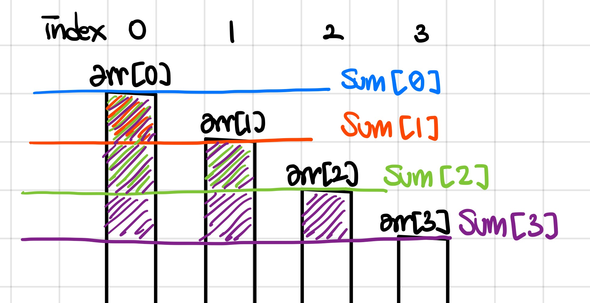
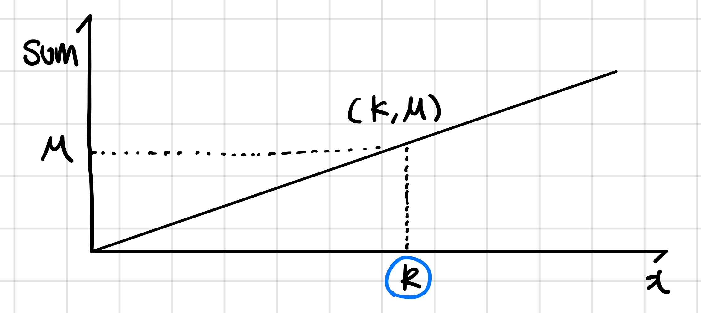
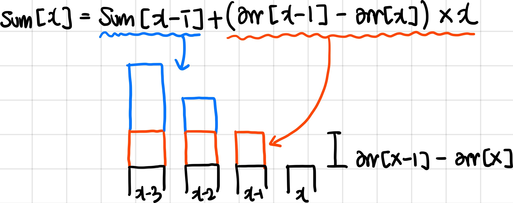
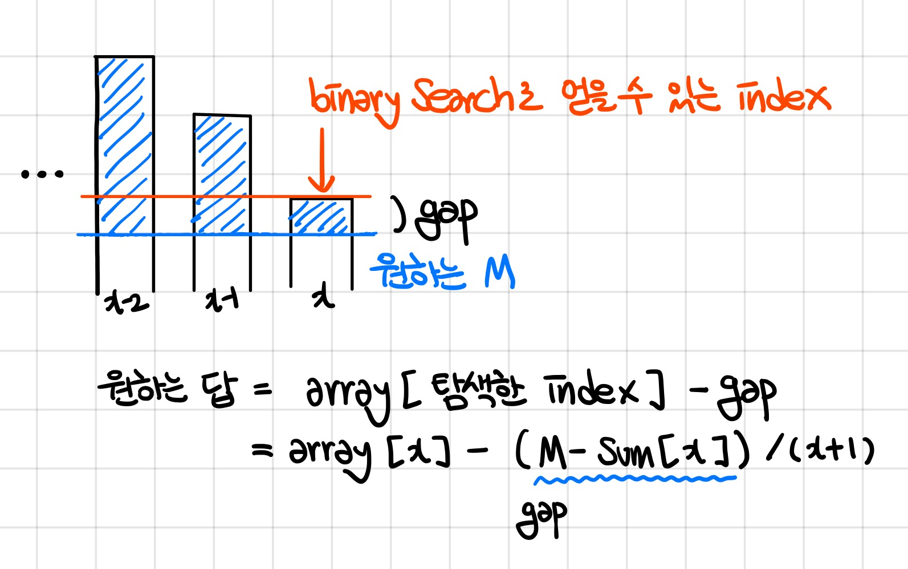
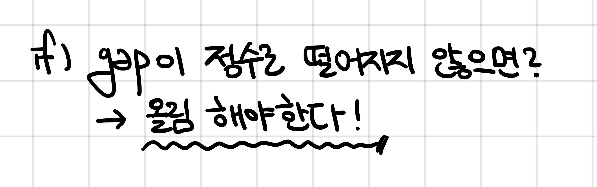

# 나무 자르기

문제 번호: 2805
알고리즘 분류: 탐색
푼 날짜: 2021년 1월 28일 오후 10:05

### 문제 링크

[https://www.acmicpc.net/problem/2805](https://www.acmicpc.net/problem/2805)

## 문제

상근이는 나무 M미터가 필요하다. 근처에 나무를 구입할 곳이 모두 망해버렸기 때문에, 정부에 벌목 허가를 요청했다. 정부는 상근이네 집 근처의 나무 한 줄에 대한 벌목 허가를 내주었고, 상근이는 새로 구입한 목재절단기를 이용해서 나무를 구할것이다.

목재절단기는 다음과 같이 동작한다. 먼저, 상근이는 절단기에 높이 H를 지정해야 한다. 높이를 지정하면 톱날이 땅으로부터 H미터 위로 올라간다. 그 다음, 한 줄에 연속해있는 나무를 모두 절단해버린다. 따라서, 높이가 H보다 큰 나무는 H 위의 부분이 잘릴 것이고, 낮은 나무는 잘리지 않을 것이다. 예를 들어, 한 줄에 연속해있는 나무의 높이가 20, 15, 10, 17이라고 하자. 상근이가 높이를 15로 지정했다면, 나무를 자른 뒤의 높이는 15, 15, 10, 15가 될 것이고, 상근이는 길이가 5인 나무와 2인 나무를 들고 집에 갈 것이다. (총 7미터를 집에 들고 간다) 절단기에 설정할 수 있는 높이는 양의 정수 또는 0이다.

상근이는 환경에 매우 관심이 많기 때문에, 나무를 필요한 만큼만 집으로 가져가려고 한다. 이때, 적어도 M미터의 나무를 집에 가져가기 위해서 절단기에 설정할 수 있는 높이의 최댓값을 구하는 프로그램을 작성하시오.

## 입력

첫째 줄에 나무의 수 N과 상근이가 집으로 가져가려고 하는 나무의 길이 M이 주어진다. (1 ≤ N ≤ 1,000,000, 1 ≤ M ≤ 2,000,000,000)

둘째 줄에는 나무의 높이가 주어진다. 나무의 높이의 합은 항상 M보다 크거나 같기 때문에, 상근이는 집에 필요한 나무를 항상 가져갈 수 있다. 높이는 1,000,000,000보다 작거나 같은 양의 정수 또는 0이다.

## 출력

적어도 M미터의 나무를 집에 가져가기 위해서 절단기에 설정할 수 있는 높이의 최댓값을 출력한다.

## 조건

- 시간 제한 : 1s
- 메모리 제한 : 256MB

---

## 해설

자르고자 하는 높이인 H를 이분 탐색으로 찾아 해결할 수 있다. 정해진 높이 H에 대해 합계가 상승하는 형태의 그래프를 그린다. 즉 정렬되어 있으므로, 적당한 H를 구할 때 까지 이분 탐색으로 탐색하면 원하는 H를 구할 수 있다.

## 풀이

이분 탐색은 0~나무의 최대 높이 범위에서 진행된다. 중간 값을 계속 찾아다니는 탐색방법에 맞게 알고리즘을 설계한다. 구하고자 하는 H는 최댓값이므로, 이분탐색 과정에서 큰 쪽으로 이동할 때만 해당 값을 결과값에 임시 저장해두고, 최종적으로 탐색을 끝냈을 때는 적절한 최댓값이 들어있다. 

---

## 코멘트

이번 문제는 고생 좀 했다.

## 코드

```cpp
#include <iostream>
#include <algorithm>

using namespace std;

int main() {
    int M, N;
    int max = 0;
    int left, right;
    int result = 0;
    
    cin >>  N >> M;
    int* tree = new int[N];
    
    for(int i = 0; i < N; i++) {
        cin >> tree[i];
        if(tree[i]>max) max=tree[i];
    }
    
    left = 0; right = max;
    
    while(left <= right) {
        int mid = (left + right) / 2;
        long total = 0;

        for (int i = 0; i < N; i++) {
            if (mid < tree[i]) {
                total += tree[i]-mid;
            }
        }
        
        if(total >= M) {
            if(result < mid)
                result = mid;
            left = mid + 1;    
        } else {
            right = mid - 1;
        }
    }
    
    printf("%d", result);   
}
```

---

## 고민

처음 한 생각은 아래와 같다.



입력 받은 높이 배열을 arr라 하면, arr[i]를 기준으로 해서 잘랐을 때 나무 길이의 합을 sum[i]에 담는다.



sum 배열에서 원하는 목표치인 M을 탐색하여, 구하고자 하는 높이인 K를 찾는다.

위 생각을 구현하기 위해 아래의 수식을 작성하였다.



sum[x]는 이전 높이의 합계인 sum[x-1]에 이전 높이와 현재 높이의 차이에 해당하는 나무 개수를 곱한 값을 더하여 구할 수 있다. 



sum 배열에서 binary search로 탐색하면 나무 총 길이보다 짧거나 같은 높이의 index를 구할 수 있다. 여기에서 우리가 찾고자 하는 K를 찾기 위해서, array[x] - gap 을 해줄 수 있는데, gap은 “M까지 남은 나무 길이를 x+1 개로 나눈 값”이다. x+1로 나눈 이유는 탐색한 index에서 더 내려가기 때문이다. 

```cpp
int gap = (M-sum[nearIndex])/(nearIndex+1);
```



그러나, 이렇게 하면 소수점 높이에 대해서는 버림이 되어 원하는 결과를 얻을 수 없다. (구하는 값 : 원하는 길이의 나무를 얻을 수 있는 최대 높이) 간단하게 나누는 값보다 1 부족한 값을 더해 올림처리 해주었다. 

```cpp
int gap = (M-sum[nearIndex]+nearIndex)/(nearIndex+1);
```

이렇게 하면 아래의 코드를 얻을 수 있다!

```cpp
#include <iostream>
#include <algorithm>

using namespace std;

int binaryNearSearch(int* arr, int arrSize, int target) {
    int index = 0;
    int size = arrSize;
    
    for(int jump = size/2; jump > 0; jump /= 2) {
        while(index+jump < size && arr[index+jump] <= target) {
            index += jump;
        }
    }
    return index;
}

bool desc (int a, int b) {
    return a > b;
}

int main() {
    int N, M;
    scanf("%d %d", &N, &M);
    
    int* array = new int[N];
    int* sum = new int[N];
    
    for(int i = 0; i < N; i++) {
        scanf("%d", &array[i]);    
    }
    sort(array, array+N, desc);
    
    sum[0] = 0;
    for(int i = 1; i < N; i++) {
        sum[i] = sum[i-1] + (array[i-1]-array[i])*i;
        // if(sum[i] > 2000000000) break;
    }
    
    int nearIndex = binaryNearSearch(sum, N, M);
    int gap = (M-sum[nearIndex]+nearIndex)/(nearIndex+1);
    
    // cout << nearIndex << " " << gap << '\n';
    
    cout << (array[nearIndex] - gap);
    
    return 0;
}
```

그런데 왜 안되니.... ㅠㅠㅠㅠ 뭐가 잘못된거야...

## 코멘트

## 코드
