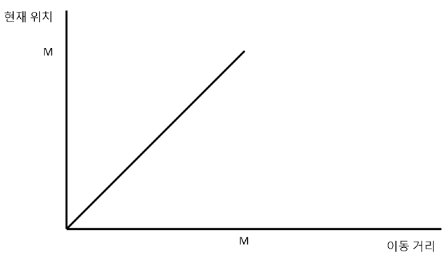

# 수상 택시

문제 번호: 2836
알고리즘 분류: 스위핑
푼 날짜: 2021년 4월 24일 오후 11:00

## 문제링크

[https://www.acmicpc.net/problem/2836](https://www.acmicpc.net/problem/2836)

## 조건

- 시간 제한 : 1s
- 메모리 제한 : 128MB

---

## 문제

상근이가 살고 있는 도시에는 큰 강이 흐르고 있고, 모든 사람의 집은 이 강 근처에 있다. 집은 0번부터 M번까지 강을 따라서 번호가 매겨져 있고, 인접한 집 사이의 거리는 모두 1 킬로미터이다.

상근이는 0번 집에 살고 있고, 보트를 이용해서 사람들을 운송하는 일을 하고 있다.

오늘은 저녁때까지 M번 집으로 가야한다. 상근이는 M번 집으로 가는 길에 사람들을 태워주려고 한다.

오늘 상근이의 수상 택시를 타려고 하는 사람은 총 N명이다. 상근이는 각 사람들이 탑승할 위치와 목적지를 알고 있다. 상근이의 보트는 매우 커서 N명 모두 보트에 태울 수 있다.

예를 들어, 사람 A가 2번 집에서 8번으로 가려고 하고, B가 6에서 4로 가려고 하는 경우를 생각해보자. 상근이는 0번 집에서 시작해서, 2번에서 A를 태우고, 6번에서 B를 태울 것이다. 그 다음 4로 돌아가 B를 내려주고, 8번에서 A를 내려다준다. 그 다음에 원래 상근이가 가려고 했던 M번 집으로 가면 된다.

상근이가 모든 사람을 데려다주고, M번 집으로 가기 위해서 이동해야 하는 거리의 최솟값을 구하는 프로그램을 작성하시오.

## 입력

첫째 줄에 N과 M이 주어진다. (N ≤ 300,000, 3 ≤ M ≤ 10^9)

다음 N개 줄에는 각 사람이 상근이의 수상 택시를 타는 위치와 목적지가 주어진다. 모든 숫자는 0과 M 사이이다.

## 출력

첫째 줄에 상근이의 이동 거리의 최솟값을 출력한다.

## 해설

0에서 출발해서 M까지 가면서 아무도 사람들을 태워주지 않았다면 아래 그림처럼 최소 이동거리 M이 나왔을 것이다. 보트에는 사람을 충분히 태울 수 있을 만큼 크기가 크므로, 작은 번호의 집에서 큰 번호의 집으로 이동하는 사람들은 모두 최소 이동거리로 이동하면서 태워줄 수 있다.



6→4로 가는 사람을 태워준다고 할 때 이동거리는 아래 그래프처럼 늘어난다. 여기에서 볼 수 있듯이,  번호가 큰 집에서 작은 집으로 갈 때 이동거리가 늘어나게 된다.


만약 6→3, 4→2 로 이동하고자 하는 사람이 있다면, 따로 이동하는게 빠를까 한 번에 이동하는 게 빠를까? 두 역방향 수의 범위가 겹치는 경우에는 여러 경우를 한 번에 처리하는 방법이 더 작은 이동거리를 갖는다. 겹치지 않는 경우는 두 경우를 따로 처리해주면 된다.


## 풀이

값을 입력받아 역방향으로 이동해야하는 경우에 대해서 `work` 벡터에 저장해주었다. 도착지를 to, 출발지를 from이라 할 때, 이 두 값을 `pair<int, int>` 자료형으로 묶어서 (to, from)의 순서로 저장해주었다. 겹치는 구간에 대해 살펴보기 위해서 `work` 벡터는 오름차순으로 정렬해준다.

```cpp
vector<pair<int, int>> work;
    
int N, M;
cin >> N >> M;

for(int i = 0; i < N; i++) {
    int from, to;
    cin >> from >> to;

    if(from > to) {
        work.push_back(pair<int, int>(to, from));
    }
}

sort(work.begin(), work.end());
```

아래 그림에서 살펴볼 수 있듯이, 역방향으로 K만큼 가야한다면, 이동거리는 2K만큼 늘어나게 된다. 이 점을 이용해서 이동거리의 최소값은 M부터 시작하고, 역방향 진행이 한 번 이뤄질 때 마다, 역방향 이동거리의 2배만큼 이동거리가 증가하도록 구현하면 된다.


left, right 는 현재 만들고있는 역방향에서 정방향으로 돌아가는 경우에 대해 출발, 도착지점을 의미한다. 만약 이번 사람의 경로가 현재 다루고 있던 경우와 합쳐질 수 없다면 (경로가 겹치지 않는다면) 지금의 경로 길이 x 2 만큼을 result에 더해주고 left, right를 새로 update 해준다. 만약 겹친다면 right 값을 update하여 현재 역방향으로 이동해아하는 경로를 더 길게 만들어준다. 

```cpp
long long result = M;
int left = -1, right = -1;

for(auto x : work) {
    if(x.first > right) {
        result += (right - left)*2;
        left = x.first;
        right = x.second;
    } else {
        right = max(right, x.second);
    }
}

result += (right-left)*2;

cout << result;
```

마지막에 더하지 못한 현재 다루고 있는 역방향 경로에 대해 result에 값을 더해주고 result를 출력해주면 원하는 결과를 얻을 수 있다.

---

## 코멘트

이정도는 이제 쉽지~ 쉬운 문제라 그런가..? ㅋㅋㅋ

---

## 코드

```cpp
#include <iostream>
#include <vector>
#include <algorithm>

using namespace std;

int main() {
    ios::sync_with_stdio(false);
    cin.tie(0);

    vector<pair<int, int>> work;
    
    int N, M;
    cin >> N >> M;
    
    for(int i = 0; i < N; i++) {
        int from, to;
        cin >> from >> to;

        if(from > to) {
            work.push_back(pair<int, int>(to, from));
        }
    }

    sort(work.begin(), work.end());

    long long result = M;
    int left = -1, right = -1;

    for(auto x : work) {
        if(x.first > right) {
            result += (right - left)*2;
            left = x.first;
            right = x.second;
        } else {
            right = max(right, x.second);
        }
    }

    result += (right-left)*2;

    cout << result;
    return 0;
}
```