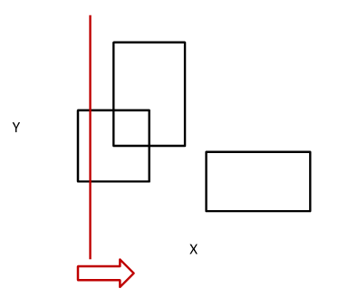

# 화성지도

문제 번호: 3392
알고리즘 분류: 스위핑
푼 날짜: 2021년 4월 24일 오후 1:47

## 문제링크

[https://www.acmicpc.net/problem/3392](https://www.acmicpc.net/problem/3392)

## 조건

- 시간 제한 : 1s
- 메모리 제한 : 128 MB

---

## 문제

2051년, 야심차게 발사한 화성탐사선 성화가 탐사한 곳의 화성 지도를 N개 보냈다.

화성탐사선의 성공에 의기양양해진 BaSA(Baekjoon Space Agency)는 야심찬 계획을 발표했다.

화성 전체 지도를 만들겠습니다!

전체 지도를 만들기 전에, 지금까지 화성탐사선이 보낸 지도를 모두 합쳤다. 이때, 이 지도의 크기는 몇일까?

탐사선이 보낸 지도는 항상 직사각형 모양이며, 겹칠 수도 있다.

## 입력

첫째 줄에 화성탐사선 성화가 보낸 지도의 수 N(1 ≤ N ≤ 10,000)이 주어진다. 다음 N개의 줄에는 각 지도의 정보가 주어진다. 지도의 정보는 네 정수 x1, y1, x2, y2 (0 ≤ x1 < x2 ≤ 30,000, 0 ≤ y1 < y2 ≤ 30,000)으로 이루어져 있다. (x1, y1)와 (x2, y2)은 직사각형의 왼쪽 아래 좌표와 오른쪽 위 좌표이다. 모든 지도는 직사각형이고, 변은 항상 x축과 y축에 평행하다.

## 출력

첫째 줄에 지금까지 탐사선이 보낸 지도를 모두 합쳤을 때, 그 면적을 출력한다. (직사각형을 모두 합쳤을 때 면적)

## 해설

왼쪽(x = 0)에서 오른쪽 (x = 30000)으로 가면서 x축에 수직인 선 상에 있는 사각형 면적의 넓이를 더해나가는 방법을 사용해주었다. 



기본적으로 Y의 범위가 0~30000으로 충분히 배열로 저장 가능한 범위이기에 현재 X에 대해 Y가 지도에 해당하는지를 확인하기 위해 Y의 활성화 상태를 검사할 수 있는 배열 `ys`을 만들어준다. X를 왼쪽에서 오른쪽으로 옮기면서 전체 면적에 추가하고, 지도에 대응하도록 `ys`를 업데이트 해준다. 아래 그림에서 붉은 면적이 계산 완료된 전체 면적에 해당하고, 붉은 선 위에 있는 사각형 면적이 현재 추가중인 면적에 해당한다. 여기에 사각형 면적이 얼마나 되는지를 검사하기 위해 `ys`를 업데이트 해준다.


## 풀이

해설에서 써둔 것처럼 X값을 이동하면서 값들을 계산하기 위해서는 X 좌표에 대해서 오름차순으로 정렬되어 있어야 한다. 또, 주어진 도형이 축에 평행한 변을 갖는 직사각형이므로, 굳이 경로에 있는 모든 X에 대해 경우를 따져야 할 필요는 없다. 직사각형의 Y축과 평행한 **변이 시작/끝나는 지점**에 대해 `∆X x Y` 의 값을 총 결과에 더해주면 된다. 시작, 끝나는 변을 기준으로 계산이 이루어지기 때문에, 이 값들을 묶어서 저장하기 위해 square 구조체를 선언하였다. `ySize`는 세로변의 길이, `start`는 이 변이 직사각형의 시작/끝 점을 구분하는데 사용한다. 

```cpp
struct square{
    int x;
    int y;
    int ySize;
    bool start;

    square(int xIn, int yIn, int ySizeIn, bool startIn) {
        x = xIn;
        y = yIn;
        ySize = ySizeIn;
        start = startIn;
    }
};

// 구조체를 정렬할 때는 x 값을 기준으로만 정렬해주면 문제 해결이 가능하다.
bool compare(square A, square B) {
    return A.x < B.x;
}
```

아래 방식으로 입력을 받아준다. 그럼 아래 그림처럼 `map` 벡터에 값들이 저장되어 있다.

```cpp
int N;
cin >> N;
vector<square> map;

for(int i = 0; i < N; i++) {
    int inx, iny, outx, outy;
    cin >> inx >> iny >> outx >> outy;

    square start = square(inx, iny, outy-iny, true);
    map.push_back(start);
    square end = square(outx, outy, outy-iny, false);
    map.push_back(end);
}

sort(map.begin(), map.end(), compare);
```


이제 X = 0 ~ 30000 에 대해 사각형들의 면적을 해야한다. 현재 y가 지도에 포함된 상태인지를 나타내는 배열 `ys`를 사용해주었다. 이 배열의 자료형을 bool로 두었다면 현재 지도에 포함되었는지 아닌지만을 나타낼 수 있겠지만, **자료형을 int**로 두어 현재 몇 개의 지도 위에 겹쳐서 포함되어있는지를 나타낼 수 있게 해주었다. 이를 통해 1개의 사각형이 끝나 빠져나갔더라도, 다른 사각형에 포함되어 있는 상태이면 계속 지도 면적에 포함될 수 있도록 구현하였다. 

X가 첫 변에 도착했을 때는 아무 사각형이 없었던 상태이므로, y가 0이여서 지도에 아무것도 추가되지 않는다. 그 다음, 변이 사각형의 시작에 해당하므로, y에 해당 변의 크기 만큼 y값들이 `ys[y]++` 된다.


그 다음 변에 대해 처리할 때 ∆x(이전 변 ~ 현재 변까지의 x값 변화량) * y 크기 만큼 최종 면적에 값이 추가되어야 한다. 이전 변과 현재 변까지의 x 값 차이 * `ys` 배열에서 0이 아닌 값을 갖는 원소의 개수가 진행한 면적에 대한 이후 변이 사각형의 시작에 해당하므로, 앞 경우와 동일하게 `ys` 배열을 업데이트 해준다. 중복으로 사각형이 포함되는 면적에 대해서는 `ys[y]` 값이 2 이상의 값이 되어있다.


새로운 변을 만났으니, 앞의 방식으로 최종 면적에 값을 추가해준다. 이번에는 사각형이 끝나는 변에 해당하므로, `ys` 배열에서 해당 y에 해당하는 원소들의 값을 1씩 빼준다. 여기에서 값을 빼주더라도 중복되어있던 사각형 면적에 해당하는 y 값들은 아직 1 이상의 값을 갖기에, 다음 변을 만나 면적을 추가할 때 정상적으로 넓이 계산에 포함된다.


이를 코드로 구현하면 아래와 같다.

```cpp
int result = 0;
int beforex = 0;
int ys[30000] = {0};

for(auto sg : map) {
    result += (sg.x - beforex) * checkNonZeros(ys);
    if(sg.start) {
        for(int i = 0; i < sg.ySize; i++) {
            ys[sg.y + i]++;
        }
    } else {
        for(int i = 1; i <= sg.ySize; i++) {
            ys[sg.y - i]--;
        }
    }

    beforex = sg.x;
}
```

위 코드에서 `ys` 배열에 있는 0이 아닌 값을 계산하기 위한 `checkNonZeros` 함수는 아래처럼 선언해주면 된다.

```cpp
int checkNonZeros(int arr[30000]) {
    int result = 0;
    for(int i = 0; i < 30000; i++) {
        if(arr[i] != 0) { 
            result++;
        }
    }
    return result;
}
```

`ys` 배열을 업데이트 해주는 코드에서 범위가 저렇게 지정된 이유는 5~10의 사각형이라면 실제 y값은 '5, 6, 7, 8, 9' 5개의 y값에 해당하는 지도가 칠해져서 5의 y 크기를 갖기 때문이다. 이러한 이유로 K~T의 높이를 갖는 사각형은 K~T-1 의 범위에 해당하는 y 값을 update 해준다.

위 코드를 사용한 후, `result` 값을 출력해주면 원하는 결과를 얻을 수 있다.

---

## 코멘트

y 범위 때문에 삽질하고 있었던 문제!

ppt로 삽입 사진 만들고 캡쳐로 넣으니깐 생각보다 깔끔하게 잘 들어가는 것 같네?

---

## 코드

```cpp
#include <iostream>
#include <vector>
#include <algorithm>

using namespace std;

struct square{
    int x;
    int y;
    int ySize;
    bool start;

    square(int xIn, int yIn, int ySizeIn, bool startIn) {
        x = xIn;
        y = yIn;
        ySize = ySizeIn;
        start = startIn;
    }
};

bool compare(square A, square B) {
    return A.x < B.x;
}

int checkNonZeros(int arr[30000]) {
    int result = 0;
    for(int i = 0; i < 30000; i++) {
        if(arr[i] != 0) { 
            result++;
        }
    }
    return result;
}

int main() {
    ios::sync_with_stdio(false);
    cin.tie(0);

    int N;
    cin >> N;
    vector<square> map;

    for(int i = 0; i < N; i++) {
        int inx, iny, outx, outy;
        cin >> inx >> iny >> outx >> outy;

        square start = square(inx, iny, outy-iny, true);
        map.push_back(start);
        square end = square(outx, outy, outy-iny, false);
        map.push_back(end);
    }

    sort(map.begin(), map.end(), compare);

    int result = 0;
    int beforex = 0;
    int ys[30000] = {0};

    for(auto sg : map) {
        result += (sg.x - beforex) * checkNonZeros(ys);
        if(sg.start) {
            for(int i = 0; i < sg.ySize; i++) {
                ys[sg.y + i]++;
            }
        } else {
            for(int i = 1; i <= sg.ySize; i++) {
                ys[sg.y - i]--;
            }
        }

        beforex = sg.x;
    }

    cout << result;
    return 0;
}
```